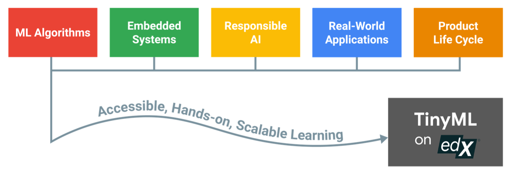

# Embedded Artificial Intelligence (DCA 0306)
This repository contains files of Embedded Artificial Intelligence (DCA 0306) at Federal University of Rio Grande do Norte.

Source: [Reddi (2021)](https://arxiv.org/pdf/2106.04008.pdf)

## :bookmark_tabs: Papers

- Vijay Janapa Reddi et al. Widening Access to Applied Machine Learning with TinyML 

    - My review about this paper: 

- Sam Leroux et al. TinyMLOps: Operational Challenges for Widespread Edge AI Adoption 

    - My review about this paper: 

## :file_folder: Projects

 - Cat, Dog and Panda Classifier 

- LeNet5 

- Face Mask Detection 

- Face Mask Detection using TinyML

## :books: Reference 
- Ivanovitch's repository: 