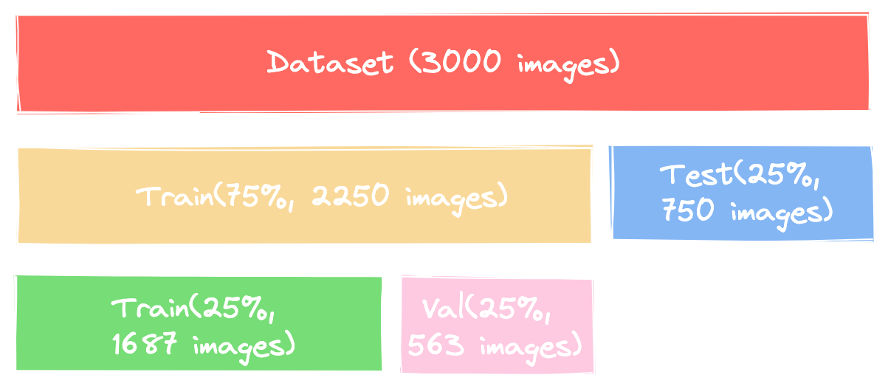

# Model Card
Model cards are a succinct approach for documenting the creation, use, and shortcomings of a model. The idea is to write a documentation such that a non-expert can understand the model card's contents. For additional information see the Model Card paper: [](https://arxiv.org/pdf/1810.03993.pdf)

## Model details
Morsinaldo Medeiros created the models. The models are currently at version 0 and were created on October 16, 2022. A complete data pipeline was built to train the following models: 

    - K-Nearest Neighbors (KNN) from scikit-learn;
    - Multilayer Perceptron (MLP) from scikit-elarn;
    - Convolutional Neural Netowrk (CNN) from Tensorflow.

The big-picture of the data pipeline is shown below:

<center></center>

In the figure above, each yellow rectangle represents a pipeline stage, that is, a notebook that you can find in this repository. Furthermore, each orange rectangle represents an artifact that will be stored in Weights and Biases (Wandb, for short).

Note that stage 1 - `fetch_data` was performed only for the K-NN classifier, because once we have the raw-data artifact stored in wandb, we can use it in other projects.

### Parameters and Architectures

As described below, for each model, the following hyperparameters were used:

    - KNN: 
        - n_neighbors = 1 
        - n_jobs = -1
    - MLP Classifier:
        - hidden_layers: (200,200)
        - activation = 'relu'
        - solver = 'adam'
    - CNN:
        - batch_size = 64
        - conv_layer = 1
        - epoch = 200
        - hidden_layer = 0
        - learn_rate = 0.01

## Intended Use

This model is used as a proof of concept for the evaluation of an entire data pipeline incorporating Machine Learning fundamentals and as a comparison with KNN, MLP and CNN algorithms. The data pipeline is composed of the following stages: 1 - `fecht data`, 2 - `preprocess`, 3 - <s>`check data`</s>, 4 - `segregate`, 5 - `train` and 6 - `test`. For simplify, we remove the data checking from this pipeline.

## Training and Evaluation Data

The purpose of this dataset is to correctly classify an image as containing a dog, cat, or panda. Containing only 3,000 images, the Animals dataset is meant to be another introductory dataset that we can quickly train a KNN model or a MLP model and obtain initial results (no so good accuracy) that has potential to be used as a baseline. After, we trained a CNN model to compare the results obtained.

After the EDA stage of the data pipeline, it was noted that the images in training data has different resolutions. A pre-processing stage is necessary in order to normalize all images using the same size.

<center></center>

The dataset under study is split into Train and Test during the `Segregate` stage of the data pipeline. 75% of the clean data is used to Train and the remaining 25% to Test. For hyperparameter tuning, we get Train dataset  and split again into a new Train and Validation with 75% for Train and 25% remaining for Validation. The figure below shows the division performed in the dataset.

<center></center>

## Metrics
In order to follow the performance of machine learning experiments, the project marked certains stage outputs of the data pipeline as metrics. The metrics adopted are: [accuracy](https://scikit-learn.org/stable/modules/generated/sklearn.metrics.accuracy_score.html), [f1](https://scikit-learn.org/stable/modules/generated/sklearn.metrics.f1_score.html#sklearn.metrics.f1_score), [precision](https://scikit-learn.org/stable/modules/generated/sklearn.metrics.precision_score.html#sklearn.metrics.precision_score), [recall](https://scikit-learn.org/stable/modules/generated/sklearn.metrics.recall_score.html#sklearn.metrics.recall_score).

To calculate the evaluations metrics is only necessary to run:

The follow results will be shown:

 **Algorithm**  |  **Stage [Run]**                        | **Accuracy** | **F1** | **Precision** | **Recall** | 
----------------|---------------------------------|--------------|--------|---------------|------------|
 KNN    | Test [lilac-river-5](https://wandb.ai/morsinaldo/first_image_classifier/runs/3coe5u1j?workspace=user-morsinaldo) | 0.4693      | 0.4737 | 0.5419        | 0.4693    |  
 MLP     | Test [charmed-butterfly-31](https://wandb.ai/morsinaldo/mlp_classifier/runs/8xqug34y?workspace=user-morsinaldo)  | 0.5053      | 0.4526 | 0.4865        | 0.5053     |
  CNN    | Test [ethereal-serenity-10](https://wandb.ai/morsinaldo/cnn_classifier/runs/sobk3tsv?workspace=user-morsinaldo) | 0.6467      | 0.6286 | 0.6613        | 0.6467     |  

  You can check all complete runs from each project below:

 - [first_image_classifier](https://wandb.ai/morsinaldo/first_image_classifier?workspace=user-morsinaldo)

- [mlp_classifier](https://wandb.ai/morsinaldo/mlp_classifier?workspace=user-morsinaldo)

- [cnn_classifier](https://wandb.ai/morsinaldo/cnn_classifier?workspace=user-morsinaldo)

 ## Ethical and Environmental considerations

 We may be tempted to claim that this dataset contains the only attributes capable of predicting if there is a cat, dog or a panda in an image. However, this is not the case. The dataset is composed of 3,000 images, which is a small number of images to train a model. The dataset is also composed of images with different resolutions, which may lead to a model that is not robust to different image sizes. Also, the dataset does not contain attributes that could infringe someone's rights or harm in any way.

 ## Caveats and Recommendations

 It should be noted that the model trained in this project was used only for validation of a complete data pipeline. It is notary that some important issues related to size of images exist, and adequate techniques need to be adopted in order to balance it. Including data augmentation techniques, for example. Other more appropriate models should be used in order to obtain better results such as Convolutional Neural Networks (CNNs).

 Given the environmental concerns raised in recent years because of the emission of CO2 into the atmosphere, a library named `codecarbon` was used to measure the amount of energy spent and the amount of CO2 released for the training of a neural network.As neural networks require a large computational cost, mainly GPU, the library was used to measure how much CO2 was released into the atmosphere and how much energy was spent during training and hyperparameter tuning.

 #### Running without sweep (one CNN model)
- Energy consumed: 0.00087 kWh
- CO² emission: 0.00019 kg

#### Running with sweep (5 CNN models)
- Energy consumed: 0.0032231 kWh
- CO² emission: 0.0007044 kg


 ## How to run this project

1- Create an account at [Wandb site](https://wandb.ai/).

2- Clone this repository with the following command:
```
git clone https://github.com/Morsinaldo/embedded_artificial_intelligence.git
```
3- Put all the codes inside the folder `Image_classifier` at [Google Colaboratory](https://colab.research.google.com/).

4- Inside every code, change the name `morsinaldo` for the name of your user at Wandb. For example:
```
run = wandb.init(entity="your_user_name",project=args["project_name"], job_type="data_segregation")
```

5- Run the files inside the folder `knn_classifier` in the following order:
   - fetch data >> preprocessing >> data_segregation >> train >> test

6- Run the files inside the folder `mlp_classifier` in the following order:
   - preprocessing >> data_segregation >> train >> test

7- Run the files inside the folder `cnn_classifier` in the following order:
   - preprocessing >> data_segregation >> train >> test

## References
- [Ivanovitch's repository for embedded artificial intelligence repository](https://github.com/ivanovitchm/embedded.ai)

- [Codecarbon's Github](https://github.com/mlco2/codecarbon)


