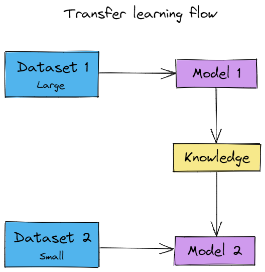
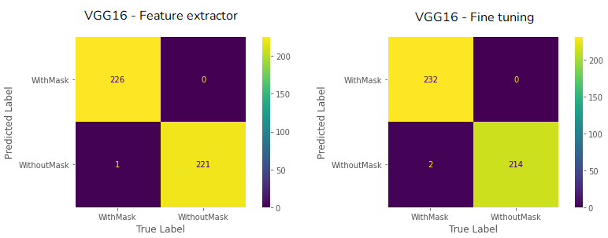

# Face Mask Detection

## Introduction
With the pandemic of COVID19, the use of masks has become of paramount importance for health protection. With this in mind, a model was trained by [Mariana](https://github.com/marianabritoazevedo), [Thaís](https://github.com/thaisaraujo2000) and myself using transfer learning with the VGG, DenseNet and MobileNet models to detect whether a person is wearing a mask or not. This project is part of the discipline Embedded Artificial Intelligence (DCA0306) taught by [Ivanovitch Silva](https://github.com/ivanovitchm) at Federal University of Rio Grande do Norte [(UFRN)](https://ufrn.br). The dataset used for training can be found on the Kaggle website. Finally, we have also put the model on the Edge Impulse platform for the community to test and enjoy.

<p align='center'>
    
</p>

The problem solving was divided into two notebooks: one responsible for transforming the dataset into an artifact and storing it in the Weights and Biases [(Wandb)](https://wandb.ai/site) platform, and the other responsible for taking this data, performing the split between training and testing, training the model, and evaluating it. Finally, we have made a model available on the [Edge Impulse](https://www.edgeimpulse.com) platform so you can test our idea and have fun. Edge Impulse is a free Machine Learning platform for developers that aims to ship Machine Learning models on edge devices.

To read more about it, you can check our article on [Medium](https://medium.com/@thaisaraujom/with-or-without-a-mask-3200bf897c64) and our pitch on [Youtube](https://youtu.be/NT5heiwqeBw)


## Data segregation

<p align='center'>
    
</p>

To perform the data segregation, the Keras utils library was used. So, the first step is to use the command below to instantiate an object with the data.
```python
raw_wb = tf.keras.utils.image_dataset_from_directory(data_dir, shuffle=True, batch_size=BATCH_SIZE, image_size=IMG_SIZE, label_mode='categorical')

```
The second step is to use the take and skip methods to take the remainder of the integer division of all batches by 5 and then skip this data to be assigned for training, respectively. The remainder of the division by 5 is by the ratio (⅕ = 0.2 = 20%). Next, the same procedure is performed to divide the training base between validation and training. The following code shows how this split is performed: 

```python
all_batches = tf.data.experimental.cardinality(raw_wb)
valtest_dataset = raw_wb.take(all_batches // 5)
train_dataset = raw_wb.skip(all_batches // 5)
 
valtest_batches = tf.data.experimental.cardinality(valtest_dataset)
test_dataset = valtest_dataset.take(valtest_batches // 5)
validation_dataset = valtest_dataset.skip(valtest_batches // 5)
```

Once the data is divided, we can move on to the transfer learning part.

## What is Transfer Learning?
Transfer learning is a technique used in neural networks and consists of reusing a trained model for problem X, which will now be applied to problem Y, so that problems X and Y are similar. There are several ways to apply transfer learning, but only two will be explored for now: feature extractor and fine-tuning.

<p align='center'>
    
</p>

## Feature extractor

Feature extractor is a technique that consists of taking the pre-trained model and stopping its propagation in an arbitrary layer (in general, the fully connected layer), extract the values of the weights and biases of the network at that moment, and use them as an array of features. By doing this, the data will no longer be associated with a classification, but with an array of features. For you to perform a feature extractor, you need to import some pre-trained model as shown in the code below. Tensorflow supports some ones like VGG, ResNet, DenseNet etc.

```python
model = tf.keras.applications.DenseNet201(input_shape=(224,224,3), include_top=False, weights='imagenet')
```
After you download the model, you must set all layers with trainable param as False. You can pass as params the input shape of your problem and you must set include_top as False to not get the model's head. In addition, you can select the dataset that the model was trained on, as imagenet, for example. Next, you can add a Global Average Pooling and a Dense output layer to classify the class. The code below shows how you can do this.

```python
model.trainable = False

image_batch, label_batch = next(iter(train_dataset))
feature_batch = model(image_batch)
 
 
global_average_layer = tf.keras.layers.GlobalAveragePooling2D()
feature_batch_average = global_average_layer(feature_batch)
 
prediction_layer = tf.keras.layers.Dense(2,"softmax")
prediction_batch = prediction_layer(feature_batch_average)
 
inputs = tf.keras.Input(shape=(224, 224, 3))
x = data_augmentation(inputs)
x = tf.keras.applications.densenet.preprocess_input(x)
x = model(x, training=False)
x = global_average_layer(x)
x = tf.keras.layers.Dropout(0.2)(x)
outputs = prediction_layer(x)
model = tf.keras.Model(inputs, outputs)

```

With this, you can train and evaluate the model.

## Fine-tuning

The fine-tuning technique is very similar to the feature extractor, however, instead of just removing the fully connected layer and outputting a feature vector, a new fully connected layer is added, generally simpler than the original one, acting directly as a classifier. To perform the fine tuning you can start by downloading the model and set all layers with trainable property as false as we did before and then use a class called FCHeadNet to build the model. FCHeadNet is provided for you in the notebook and you can execute the following steps:
```python
# initialize the new head of the network, a set of FC layers
# followed by a softmax classifier
headModel = FCHeadNet.build(base_model, len(class_names), 256)

# place the head FC model on top of the base model -- this will
# become the actual model we will train
model = Model(inputs=base_model.input, outputs=headModel)

```

In general, Fine Tuning can be divided into two or more stages depending on the problem. First, you train the model with a new fully connected classification and all early layers freeze. In the next steps, you can unfreeze more and more layers in each stage from end to start. In our case, we performed only two stages, because we already got excellent results. So in the last stage we unfreeze about 15 layers depending on the model. To unfreeze the layers, in our case with VGG16, you can use the following code: 

```python3
for layer in model.layers[4].layers[15:]:
 layer.trainable = True
```

We used index 4 because of our modelation, but this number can change depending on your code.

## Results

<div align='center'>

 **Architecture**  |  **Stage [Run]**                        | **Accuracy** | **F1** | **Precision** | **Recall** | 
----------------|---------------------------------|--------------|--------|---------------|------------|
 VGG16 [feature extractor]    | [clean-shape-3](https://wandb.ai/marianabritoazevedo/face_mask_detection/runs/x8m1f3z4/overview?workspace=user-) | 0.9955      | 0.9955 | 0.9956        | 0.9955    |  
 VGG16 [fine-tuning]     | [fast-salad-4](https://wandb.ai/marianabritoazevedo/face_mask_detection/runs/4s5tmrrt/overview?workspace=user-)  | 0.9978      | 0.9978 | 0.9978        | 0.9978     |
  DenseNet [feature extractor]    | [sparkling-sun-2](https://wandb.ai/morsinaldo/face_mask_detection/runs/ub8gpk5e/overview?workspace=user-) | 1.0      | 1.0 | 1.0 | 1.0     | 
DenseNet [fine-tuning]     | [cool-pine-3](https://wandb.ai/morsinaldo/face_mask_detection/runs/1o5wd4yr/overview?workspace=user-)  | 0.9866      | 0.9866 | 0.9870        | 0.9866     |
MobileNet [feature extractor]   | [comic-spaceship-3](https://wandb.ai/thaisaraujom/face_mask_detection/runs/27l3za7b/overview?workspace=user-)  | 0.9933      | 0.9933 | 0.9933        | 0.9933     |
MobileNet [fine-tuning]    | [elated-field-4](https://wandb.ai/thaisaraujom/face_mask_detection/runs/2sf3ylkg?workspace=user-)  | 0.9978      | 0.9978 | 0.9978        | 0.9978     | 

</div>

The figure below shows the confusion matrix of the best model in our experiment.

<p align='center'>
    
</p>

This shows us that this technique is very efficient and we get excellent results using a pre-trained model instead of training a network from scratch. Also, we can see that we can achieve good results by using a lightweight model like MobileNet, rather than using a heavy model like DenseNet.

## Environmental considerations

Given the environmental concerns raised in recent years because of the emission of CO2 into the atmosphere, a library named [Codecarbon](https://github.com/mlco2/codecarbon) was used to measure the amount of energy spent and the amount of CO2 released for the training of a neural network. As neural networks require a large computational cost, mainly GPU, the library was used to measure how much CO2 was released into the atmosphere and how much energy was spent during feature extractor and fine tuning. You can check these values by clicking on the Wandb runs in the table above. 

## Extensions

- Use other models and compare with these.
- Train the model with noise in the images as the mask in other facial positions, for example.
- Embedding some of these models in a circuit such as an arduino.
- Create a mobile or web application to consume the model.

## References

- [Codecarbon's Github](https://github.com/mlco2/codecarbon)

- [Edge Impulse](https://www.edgeimpulse.com)

- [Ivanovitch's repository for embedded artificial intelligence repository](https://github.com/ivanovitchm/embedded.ai)

- [Our Medium Link]()


